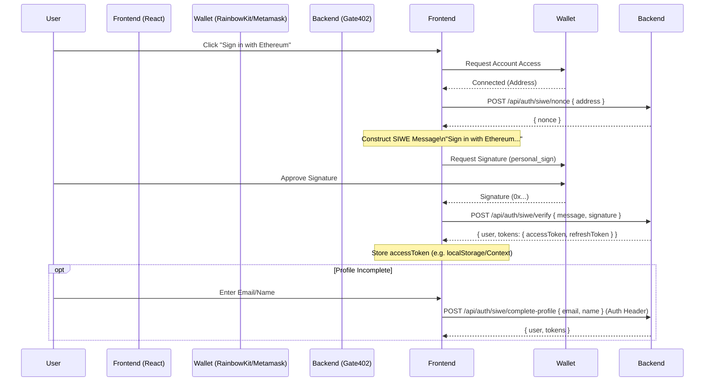

# SIWE Integration Guide (React + RainbowKit)

This guide explains how to integrate the "Sign In with Ethereum" (SIWE) flow with the Gate402 backend.

## Sequence Diagram



## Integration Steps

### Prerequisites
Ensure you have `wagmi`, `viem`, and `@tanstack/react-query` installed alongside RainbowKit.

### 1. API Client Setup
Create an axios instance to handle authentication headers automatically.

```typescript
// api.ts
import axios from 'axios';

const api = axios.create({
  baseURL: 'https://api.gate402.com', // Replace with actual API URL
});

// Add interceptor to attach token
api.interceptors.request.use((config) => {
  const token = localStorage.getItem('accessToken');
  if (token) {
    config.headers.Authorization = `Bearer ${token}`;
  }
  return config;
});

export default api;
```

### 2. The Login Hook
Here is a custom hook using `wagmi` to handle the flow.

```tsx
// useSiweLogin.ts
import { useAccount, useSignMessage } from 'wagmi';
import { useState } from 'react';
import api from './api';

export function useSiweLogin() {
  const { address } = useAccount();
  const { signMessageAsync } = useSignMessage();
  const [isLoading, setIsLoading] = useState(false);

  const login = async () => {
    if (!address) throw new Error('Wallet not connected');
    setIsLoading(true);

    try {
      // 1. Get Nonce
      const { data: { nonce } } = await api.post('/api/auth/siwe/nonce', { address });

      // 2. Prepare Message
      // Ideally use a library like `siwe` to generate this string to ensure strict compliance
      const message = `Sign in with Ethereum to Gate402\nNonce: ${nonce}`;

      // 3. Sign Message
      const signature = await signMessageAsync({ message });

      // 4. Verify & Login
      const { data } = await api.post('/api/auth/siwe/verify', {
        message,
        signature,
      });

      // 5. Store Token
      localStorage.setItem('accessToken', data.tokens.accessToken);
      localStorage.setItem('refreshToken', data.tokens.refreshToken);

      console.log(data.user)
      
      return data.user;

    } catch (error) {
      console.error('Login failed', error);
      throw error;
    } finally {
      setIsLoading(false);
    }
  };

  return { login, isLoading };
}
```

### 3. Profile Completion
If the user needs to update their profile (e.g. they have a placeholder email), use this function.

```tsx
// useUpdateProfile.ts
import api from './api';

export const updateProfile = async (email: string, name: string) => {
  const { data } = await api.post('/api/auth/siwe/complete-profile', {
    email,
    name,
  });
  
  // Update tokens if they were refreshed
  if (data.tokens) {
     localStorage.setItem('accessToken', data.tokens.accessToken);
  }
  
  return data.user;
};
```

### 4. Usage Component

```tsx
import { ConnectButton } from '@rainbow-me/rainbowkit';
import { useAccount } from 'wagmi';
import { useSiweLogin } from './useSiweLogin';

export const LoginButton = () => {
  const { isConnected } = useAccount();
  const { login, isLoading } = useSiweLogin();

  if (!isConnected) return <ConnectButton />;

  return (
    <button onClick={login} disabled={isLoading}>
      {isLoading ? 'Signing in...' : 'Sign in with Ethereum'}
    </button>
  );
};
```
